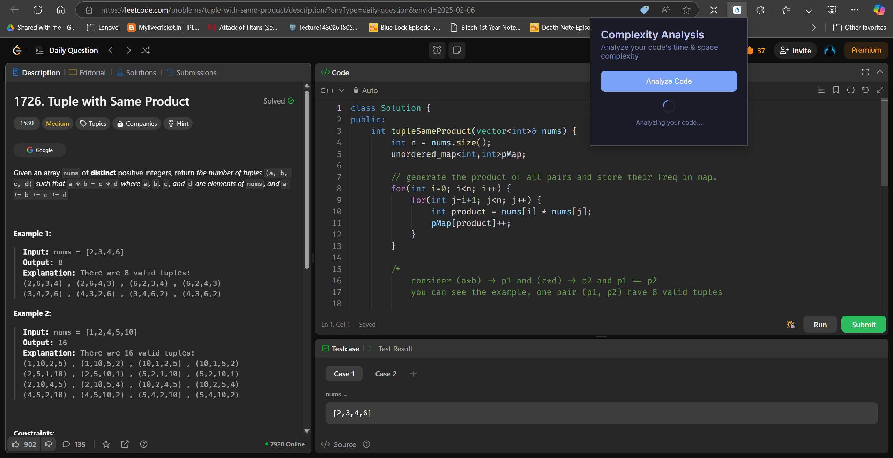
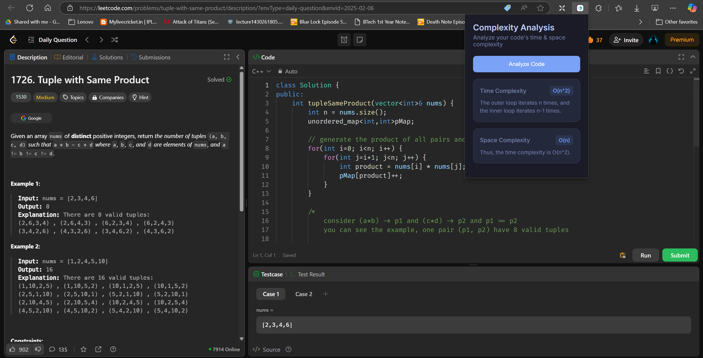

<div align="center">

# 🔍 LeetCode Complexity Analyzer

### Instantly analyze the time and space complexity of your LeetCode solutions

[](https://chrome.google.com/)
[](https://makersuite.google.com/)
[](https://opensource.org/licenses/MIT)
[](https://github.com/yourusername/leetcode-complexity-analyzer/stargazers)

[Features](#-key-features) • [Installation](#-installation) • [Usage](#-usage) • [Screenshots](#-screenshots) • [Support](#-support)

</div>

## ✨ Key Features

- **Real-time Analysis**: Get instant complexity insights for your solutions
- **AI-Powered**: Leverages Google Gemini API for accurate predictions
- **Intuitive Interface**: Clean, modern UI for seamless user experience
- **Developer Friendly**: Easy setup and configuration process

## 🚀 Installation

### Step 1: Configure Gemini API

1. Visit [Google AI Studio](https://makersuite.google.com/app/apikey)
2. Create a new API key
3. Open `popup.js` and replace the API key:
   ```javascript
   const GEMINI_API_KEY = 'your_api_key_here';
   ```

### Step 2: Install Extension

```bash
1. Navigate to chrome://extensions
2. Enable Developer Mode
3. Click "Load unpacked"
4. Select extension directory
```

## 🎯 Usage

1. Navigate to any LeetCode problem
2. Write your solution
3. Click the extension icon
4. Hit "Analyze Code"
5. View complexity breakdown

## 📸 Screenshots

<div align="center">

### Main Interface


### Analysis in Action


### Results View


</div>

## 🛠️ Technical Details

### Project Structure
```
leetcode-complexity-analyzer/
├── manifest.json      # Extension configuration
├── popup.html        # UI layout
├── popup.js         # Core functionality
├── content.js       # Page interaction
├── styles.css       # UI styling
├── Chart.js        # Visualization
└── icons/          # Extension assets
```

### Rate Limits
| Tier | Requests/Minute | Notes |
|------|----------------|-------|
| Free | 60 | Suitable for most users |
| Pro  | Unlimited | Available on request |

## 💡 Troubleshooting Guide

### Common Issues
- **Extension not responding?** Refresh the LeetCode page
- **Analysis failed?** Verify API key and internet connection
- **UI not loading?** Clear browser cache and reload

### Quick Fixes
1. Confirm you're on a LeetCode problem page
2. Verify API key configuration
3. Check console for error messages
4. Reload extension if necessary

## 🤝 Support

Need help? Here's what to do:

1. Check the [troubleshooting guide](#-troubleshooting-guide)
2. Review your configuration
3. Clear browser cache
4. Reinstall if needed

## ⭐ Support the Project

If you find this extension helpful in your LeetCode journey, consider showing your support:

<div align="center">

### ⭐ Star this Repository ⭐

Your star helps make this project more visible and encourages continued development!

[](https://star-history.com/sandeep-kalla/Leetcode-TC-Analyzer&Date)

</div>

## 📝 License

This project is licensed under the MIT License - see the [LICENSE](LICENSE) file for details.

---

<div align="center">

### Made with ❤️ for LeetCode enthusiasts

[Report Bug](https://github.com/sandeep-kalla/Leetcode-TC-Analyzer/issues) • [Request Feature](https://github.com/sandeep-kalla/Leetcode-TC-Analyzer/issues)

</div>
